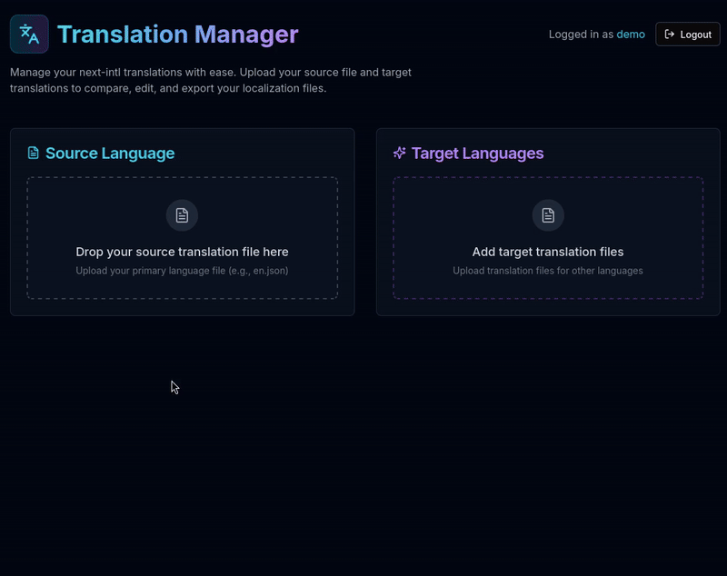

## Meldin
#### A simple translation manager.

This is a web-based tool where you can upload, compare and fill out translations files. You can use AI to assist with filling out missing translations.



Example files are like `en.json`, `fr.json`, `de.json` - standard for libraries like [next-intl](https://next-intl.dev/).

Here is a sample nested JSON structure:
```json
{
  "Generic": {
    "create": "Create",
    "update": "Update",
    "delete": "Delete",
    "cancel": "Cancel",
    "save": "Save"
  },
  "DataTable": {
    "selected": "{count} of {total} row(s) selected",
    "perPage": "Rows per page",
    "totalItems": "Total: {count}",
    "page": "Page {page} of {total}",
    "filters": "Filters",
    "clearFilters": "Clear filters",
    "noData": "No results",
    "sort": {
      "asc": "Asc",
      "desc": "Desc"
    }
  },
  "ComingSoon": {
    "title": "Coming Soon",
    "subtitle": "We are working on this feature. Stay tuned!",
    "back": "Back to home page"
  }
}
```

### Get started

To get started copy the `.env.example` file into `.env.local` and add your own values. Then run `npm install && npm run dev`.

Navigate to http://localhost:3000 and login with `admin` / `1234` if you haven't changed the default credentials. Then start uploading some files!

You will need an OpenAI API key in order to use the AI assistant. If you want you can try another LLM by changing the setup in [./app/api/translate/route.ts](./app/api/translate/route.ts) and [./app/api/translate-batch/route.ts](./app/api/translate-batch/route.ts).

### Deployment

You can deploy this app using Vercel or any other hosting provider that supports Next.js. Just make sure to set up environment variables as described above.
