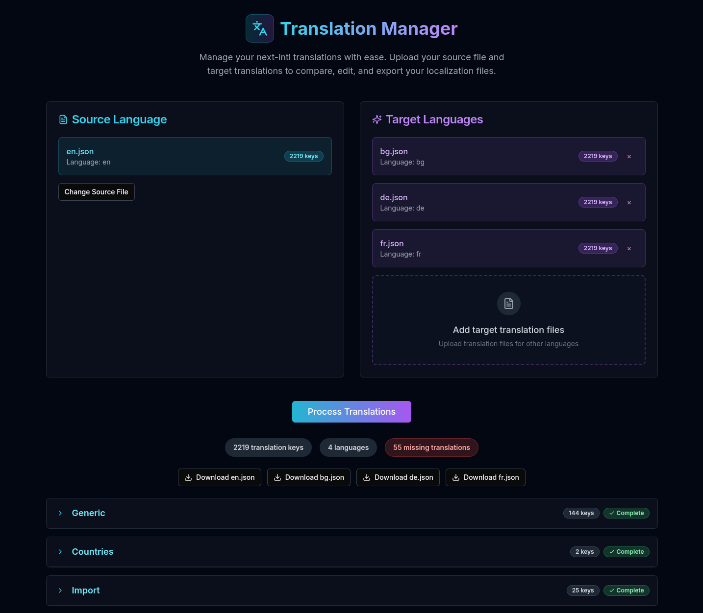

## Meldin

#### Simple translation manager



This is a web-based tool where I can upload my translation files and compare the translations between different languages.
Example files are like en.json, fr.json, de.json - standard for libraries like [next-intl](https://next-intl.dev/).

Here is a sample nested JSON structure:
```json
{
  "Generic": {
    "create": "Create",
    "update": "Update",
    "delete": "Delete",
    "cancel": "Cancel"
  },
  "Countries": {
    "label": "Country",
    "placeholder": "Select country"
  }
}
```

On the main page users specify the source file, which would be for example en.json. Then the other translation files will be uploaded as well (like fr.json and the de.json), then they are matched against the source file's keys.
The translations are compared in a table-like format with columns: Key, EN, FR, DE. The values under the first column should be show like "Generic.create", "Generic.update", etc. Under the language columns we should have the translation from the respective file. Where there is no value the field is highlighted. Note the translation texts could be long.
It's important to be able to collapse the first level of the translation. So in the example above by default users only see the "Generic" and "Countries" sections. Then I can expand the area and see all their keys.
After users are happy with the translations they should be able to download them file by file with all translations updated.